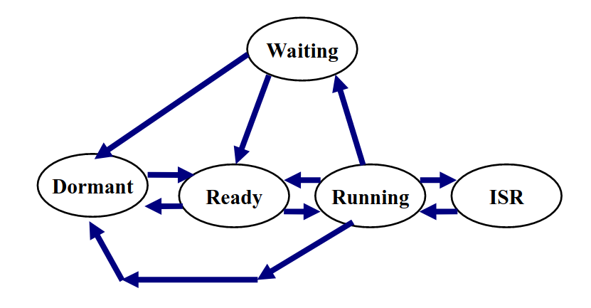

Ques_10: Draw a process or task state diagram for the RTOS you are using.

Answer: Task States for FreeRtos:
        1. DORMANT
        2. READY
        3. RUNNING 
        4. WAITING
        5. ISR (Interrupt Service Routine)

        Task state diagram for FreeRTOS:
    
        

